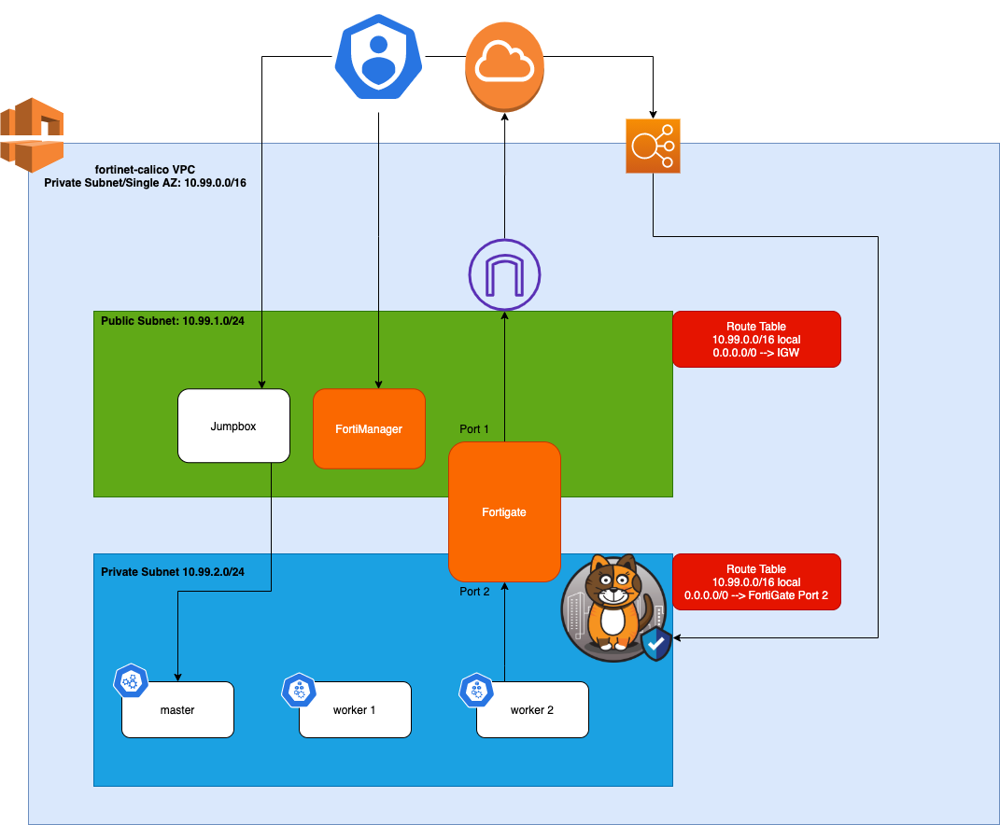

# Fortinet and Calico Solution Integration Enablement Workshop


## Summary and Goals

As a platform and security engineers, you want your apps to securely communicate with the external world. But you also want to secure the network traffic from the Kubernetes clusters using your Fortinet security fabric. Using the Fortinet/Calico Enterprise integration, security teams can retain firewall responsibility, secure traffic using Calico Enterprise network policy, which frees up time for ITOps. There are currently two solutions that this integration provides:

### Solution 1: Extend Kubernetes to Fortinet firewall devices

**Use case:** Control egress traffic for Kubernetes clusters.

**Problem:** Perimeter firewalls do not have the necessary information to act on traffic that leaves the cluster for Kubernetes workloads.

**Solution:** The Calico Enterprise/Fortinet integration leverages the power of Calico Enterprise policy selectors to provide Kubernetes workload information to FortiManager and FortiGate devices. You create perimeter firewall policies in FortiManager and FortiGate that reference Kuberetes workloads. Policies are applied and enforced by FortiGate devices. And Firewall administrators can write cluster egress policies that reference Kubernetes workloads directly in Fortinet devices.

### Solution 2: Extend FortiManager firewall policies to Kubernetes

**Use case:** Control Kubernetes clusters directly and apply policy.
**Problem:** To avoid disruption, teams need to leverage existing FortiManager as the primary user interface.

**Solution:** Use FortiManager to create firewall policies that are applied as Calico Enterprise network policies on Kubernetes workloads. Use the power of a Calico Enterprise “higher-order tier” so Kubernetes policy is evaluated early in the policy processing order, but update policy using FortiManager UI. Use the Calico Enterprise Manager UI as a secondary interface to verify the integration and troubleshoot using logs.

## Goals

The goal of this enabelemnt tutorial is to demonstrate the value of the Fortinet + Calico Enterprise integration by going through a series of learning modules focused on Calico's Integration with Fortigate and FortiManager.

For reference, you can find the product documentation around this integration [here](https://docs.tigera.io/security/firewall-integration).

## Join the Slack Channel

We have created a slack channel on the Calico User Group to discuss all things related to Calico + Fortinet. If you are not already a member of the Calico User Group Slack group you can sign up [here](https://slack.projectcalico.org/) and join the #fortinet-integration channel.

## Pre-Requisites/Requirements

- Calico Enterprise Trial or Production License along with a pull secret. If you do not have a license you can request one [here](https://www.tigera.io/tigera-products/calico-enterprise-trial#installation-trial)
- AWS credentials
- MacOS or Linux-based machine. Windows w/WSL2 will work but not tested with these instructions.
- SSH client to connect to AWS resources
- A public/private SSH key pair created and added in your AWS account and for the specifc region you wish to run this in.
- Git
- [Terraform](https://learn.hashicorp.com/tutorials/terraform/install-cli) v0.13+ installed locally.

## Architecture

Below is an architecture diagram of the various components that will be deployed. They are:

- A VPC with two subnets: one private and one public.
- An Internet Gateway attached to the Public Subnet
- A default security group to allow SSH acces, HTTP/HTTPs traffic, and specific TCP ports for Fortigate and FortiManager.
- Three EC2 instances for k8s: `master`, `worker-1`, and  `worker-2`.
- A FortiGate and FortiManager VMs (PAYG).



## Workshop Modules

- [Module 1: Setting up your Local Environment](./modules/setting-up-local-env.md)
- [Module 2: Creating Your AWS Environment with Terraform](./modules/setting-up-aws.md)
- [Module 3: Configuring Fortigate to allow Internet Traffic](./modules/configuring-fortigate-to-allow-internet.md)
- [Module 4: Accessing the K8s Nodes](./modules/accessing-your-k8s-nodes.md)
- [Module 5: Creating Your Kubernetes Cluster](./modules/creating-your-k8s-cluster.md)
- [Module 6: Joining Worker Nodes](./modules/join-nodes.md)
- [Module 7: Installing and Configuring Calico Enterprise](./modules/installing-calico.md)
- [Module 8: Integrating Calico Enterprise with FortiGate](./modules/integrate-calico-fortigate.md)
- [Module 9: Running a Sample Application to validate Calico + FortiGate Integration](./modules/deploy-app-0.md)
- *(WIP)* [*Module 10: Integrating FortiGate with FortiManager*](./modules/integrate-fortigate-fortimanager.md)
- *(WIP)* [*Module 11: Manage North-South policies with FortiManager*](./modules/manage-north-south-policies-with-fortimanager.md)
- [Module 12: Integrating Calico Enterprise with FortiManager for East-West policy management](./modules/integrate-calico-with-fortimanager.md)
- [Module 13: Running a Sample Application to validate Calico + FortiManager Integration](./modules/deploy-app-1.md)

### Cleanup

1. You need to make sure you delete the loadbalancer service first.

    ```bash
    kubectl delete -f 3-loadbalancer.yaml
    ```

2. Now you can issue a `terraform destroy` to fully remove all the environment resources.

    ```text
    terraform destroy

    ...
    Do you really want to destroy all resources?
      Terraform will destroy all your managed infrastructure, as shown above.
      There is no undo. Only 'yes' will be accepted to confirm.

      Enter a value: yes
    ```

    >AWS creates and attaches a security group to the load balancer resource when the `LoadBalancer` service is created on the Kubernetes side. This security group may not be cleaned up when teh `LoadBalancer` service is removed from the Kubernetes side which may cause the `terraform destroy` command to not cleanup the `VPC`. If this happens, you should manually cleanup the security group and the VPC. In such case the `VPC` ID will be printed in `terraform destroy` output.
