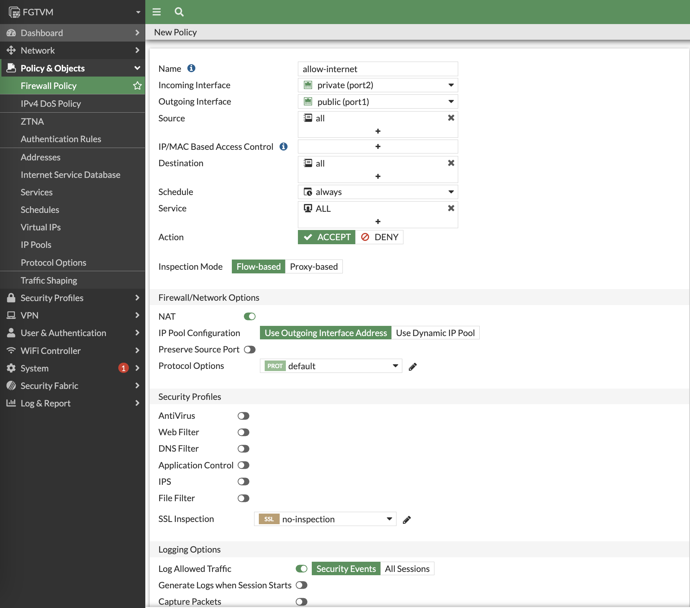

# Module 3: Configurating your FortiGate Firewall to allow internet traffic for the K8s Cluster

Goal: In this step, you will configure FortiGate firewall to act as the default gateway to the private subnet. This will ensure that all k8s traffic leaving the private subnet will go through FortiGate.

## Steps

1. From your browser, log into FortiGate Firewall using the public IP and port `443` provided to you in the output of the `terraform apply` step.

2. The default username is `admin` and the default password is the **EC2 Instance ID**. Once you log in, change the password. Then log in with the new password that you created.

3. Navigate to **Policy and Objects** > **IPv4 Policy** *(or __Firewall Policy__)* then create a policy to allow ALL traffic from **Port 2** --> **Port 1**. This is required to ensure that traffic from the k8s cluster passes through the FortiGate firewall.

[Next -> Module 4](../modules/accessing-your-k8s-nodes.md)