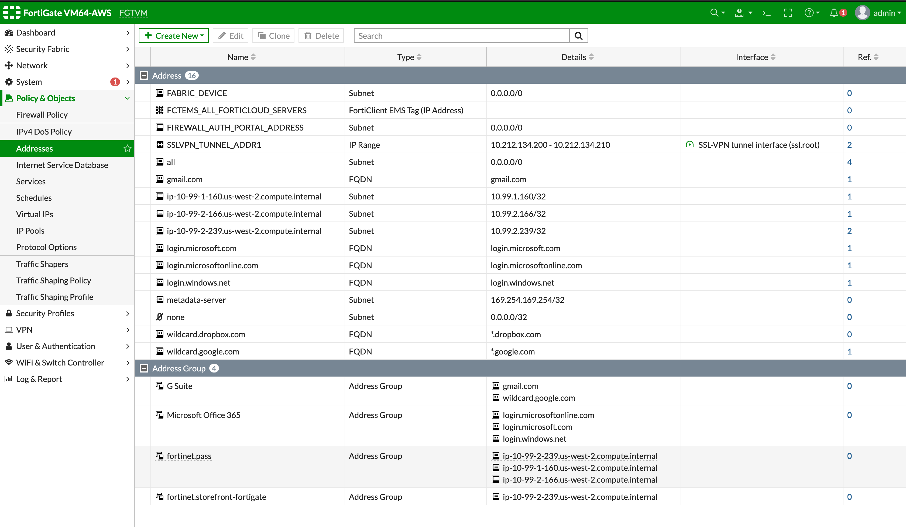
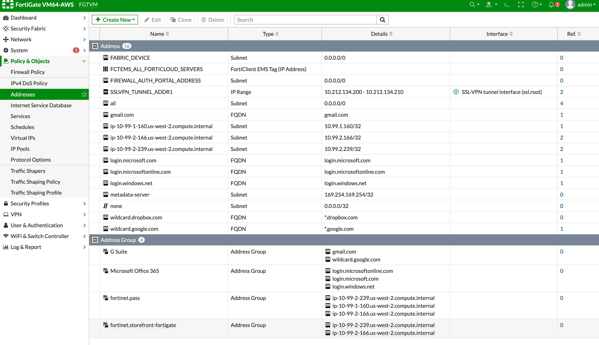
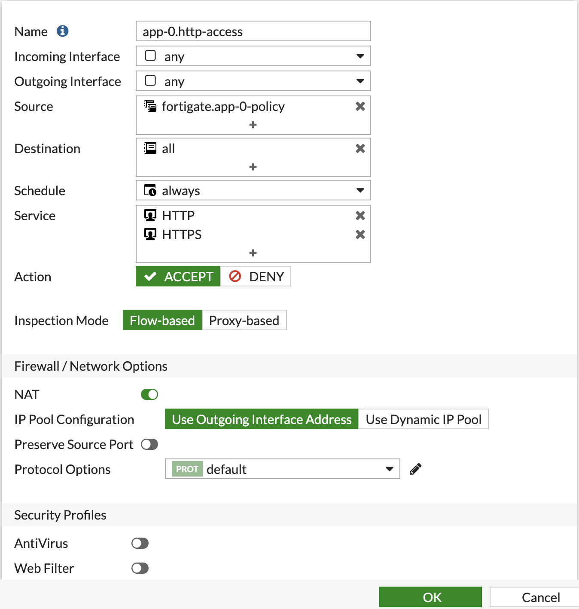

# Module 9: Running a Sample Application to test the Calcio+FortiGate Integration

**Goal:** We are now ready to verify the integration by launching an application and scaling its pods to ensure that the pods' IPs are automatically populated in FortiGate.

## Steps

1. Under the `demo` subdirectory, there is a `tiers.yaml` and `app-0.yaml` deployment files. Let's take a look at the `tiers.yaml`:

```yaml
apiVersion: projectcalico.org/v3
kind: Tier
metadata:
  name: fortimanager
spec:
  order: 900
---
apiVersion: projectcalico.org/v3
kind: Tier
metadata:
  name: fortigate
spec:
  order: 800
---
apiVersion: projectcalico.org/v3
kind: Tier
metadata:
  name: platform
spec:
  order: 700
---
apiVersion: projectcalico.org/v3
kind: Tier
metadata:
  name: security
spec:
  order: 500
---
apiVersion: projectcalico.org/v3
kind: GlobalNetworkPolicy
metadata:
  name: fortigate.pass
spec:
  tier: fortigate
  order: 300
  selector: ''
  namespaceSelector: ''
  serviceAccountSelector: ''
  ingress:
    - action: Pass
      source: {}
      destination: {}
  egress:
    - action: Pass
      source: {}
      destination: {}
  doNotTrack: false
  applyOnForward: false
  preDNAT: false
  types:
    - Ingress
    - Egress
---
apiVersion: projectcalico.org/v3
kind: GlobalNetworkPolicy
metadata:
  name: fortimanager.pass
spec:
  tier: fortimanager
  order: 300
  selector: ''
  namespaceSelector: ''
  serviceAccountSelector: ''
  ingress:
    - action: Pass
      source: {}
      destination: {}
  egress:
    - action: Pass
      source: {}
      destination: {}
  doNotTrack: false
  applyOnForward: false
  preDNAT: false
  types:
    - Ingress
    - Egress
---
apiVersion: projectcalico.org/v3
kind: GlobalNetworkPolicy
metadata:
  name: platform.pass
spec:
  tier: platform
  order: 300
  selector: ''
  namespaceSelector: ''
  serviceAccountSelector: ''
  ingress:
    - action: Pass
      source: {}
      destination: {}
  egress:
    - action: Pass
      source: {}
      destination: {}
  doNotTrack: false
  applyOnForward: false
  preDNAT: false
  types:
    - Ingress
    - Egress
---
apiVersion: projectcalico.org/v3
kind: GlobalNetworkPolicy
metadata:
  name: security.pass
spec:
  tier: security
  order: 300
  selector: ''
  namespaceSelector: ''
  serviceAccountSelector: ''
  ingress:
    - action: Pass
      source: {}
      destination: {}
  egress:
    - action: Pass
      source: {}
      destination: {}
  doNotTrack: false
  applyOnForward: false
  preDNAT: false
  types:
    - Ingress
    - Egress
---
apiVersion: projectcalico.org/v3
kind: GlobalNetworkPolicy
metadata:
  name: fortigate.app-0-policy
spec:
  tier: fortigate
  selector: app == "app-0"
  namespaceSelector: ''
  serviceAccountSelector: ''
  egress:
    - action: Allow
      source: {}
      destination: {}
  doNotTrack: false
  applyOnForward: false
  preDNAT: false
  types:
    - Egress
```

This deployment creates the necessary Calico Enterprise Tiers , one of which is the `fortigate` Tier. This tier is the one that we have configured in the previous module to associate all policies under it with a FortiGate Address group. There are also other tiers like `security` and `platform` that are used for demonstrative purposes. Finally, the last part of it is the `GlobalNetworkPolicy` that maps out the application labels to Fortigate address group. In our example, this configuration will create a Fortigate Address group named `app-0-policy` that automatically detects and populate the node IPs of any pod with label `app == 'app-0'`

2. You deploy them:

```
$ kubectl apply -f tiers.yaml 
$ kubectl apply -f app-0.yaml
```

Verify that the  application is deployed:

```
$ kubectl get pod -n ns0
NAME                     READY   STATUS    RESTARTS   AGE
app-0-5f7f5dcfc9-tmpfr   1/1     Running   0          13m
```

3. In the FortiGate portal, navigate to **Policy & Objects > Addresses**. Once the application is deployed, you should see that an **app-0-policy** address group is created and the respective Node IPs are associated with it.



4. It's time to showcase what would happen as we scale the `app-0` service. As we increase the number of pods, we should see the Address Group in FortiGate reflect the nodes that the pods are deployed in.

```
$ kubectl scale deployment/app-0 -n ns0 --replicas=2
```



5. You can now explore creating policies within FortiGate that use this address group.

Create a policy in FortiGate, e.g. `app-0.http-access`, which controls HTTP access for `app-0` address group. Test HTTP access from `app-0` pods while switching the policy action between `ACCEPT` and `DENY`.

  

```bash
kubectl -n ns0 exec -t centos -- curl gooble.com
```
