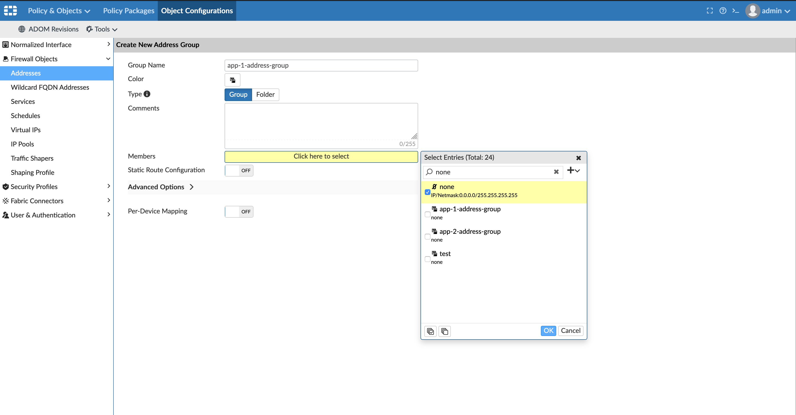
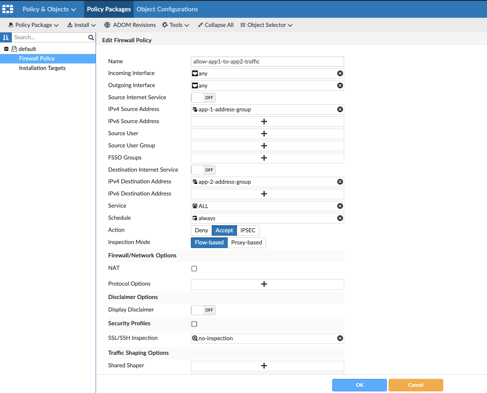
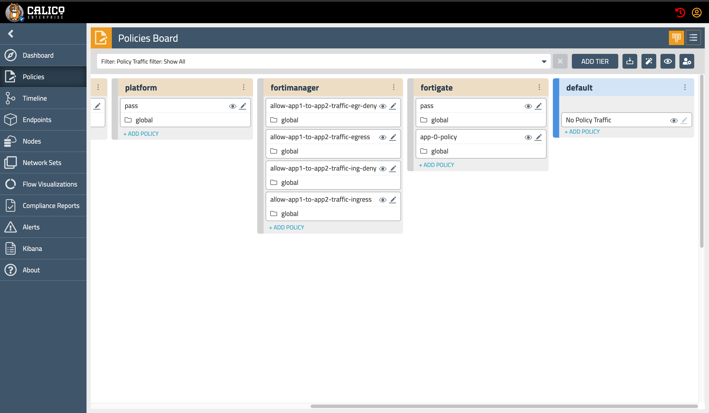

# Module 12: Running a Sample Application to validate the Calico+FortiManager Integration

**Goal:** We are now ready to verify the Calico Enterprise and FortiManager integration is working by launching an application and configuring a policy in FortiManager to be translated to Calico Policies. 


## Steps

1. Under the `demo` subdirectory, there is a `app-1.yaml` deployment file. Let's take a look at the `app-1.yaml`:


```
kind: Namespace
apiVersion: v1
metadata:
  name: ns1
  labels:
    compliance: open
    env: dev
---
apiVersion: apps/v1
kind: Deployment
metadata:
  name: app-1
  namespace: ns1
spec:
  selector:
    matchLabels:
      app: app-1
  replicas: 2
  template:
    metadata:
      labels:
        app: app-1
        tigera.io/address-group: app-1-address-group 
    spec:
      containers:
      - name: nginx
        image: nginx
        ports:
        - containerPort: 80
        resources: {}
---
apiVersion: apps/v1
kind: Deployment
metadata:
  name: app-2
  namespace: ns1
spec:
  selector:
    matchLabels:
      app: app-2
  replicas: 2
  template:
    metadata:
      labels:
        app: app-2
        tigera.io/address-group: app-2-address-group 
    spec:
      containers:
      - name: nginx
        image: nginx
        ports:
        - containerPort: 80
        resources: {}
---
apiVersion: v1
kind: Service
metadata:
  name: app-1-svc
  namespace: ns1
  labels:
    service: app-1-svc
spec:
  ports:
  - port: 80
    targetPort: 80
    protocol: TCP
  selector:
    app: nginx
---
apiVersion: v1
kind: Service
metadata:
  name: app-2-svc
  namespace: ns1
  labels:
    service: app-2-svc
spec:
  ports:
  - port: 80
    targetPort: 80
    protocol: TCP
  selector:
    app: nginx
```

This deployment creates two sample `nginx` deployments in `ns1` called `app-1` and `app-2`. Our goal here is to configurate FortiManager Policy Packages to secure these two applications using Calico Policies. You will notice that we have a label `tigera.io/address-group` that identifies which FortiManager Address Group this application belongs to. In our case the values are `app-1-address-group` and `app-2-address-group`. Let's deploy the app:

2. You deploy them:

```
$ kubectl apply -f app-1.yaml
```

Verify that the  application is deployed:

```
$ $ kubectl get pod -n ns1
NAME                     READY   STATUS    RESTARTS   AGE
app-1-66db7b7fb9-4kp8h   1/1     Running   1          21h
app-1-66db7b7fb9-52rq5   1/1     Running   1          21h
app-2-755b9959bf-djw48   1/1     Running   1          21h
app-2-755b9959bf-gzj28   1/1     Running   1          21h
```

3. In the FortiManager portal, navigate to **Policy & Objects > Object Configurations > Create New > Address Group**. We need to create two empty Address Groups: `app-1-address-group` and `app-2-address-group`. When you select Members, ensure you search for "None" and select that option. 



4. Repeat the process for `app-2-address-group`. 

5. Now you will create a policy under the **Policy Packages** tab to secure the two applications. Click on **Create New** and fill the values as the below image:




6. Now you can validate that this policy was translated by Calico Enterprise into a Kubernetes/Calico Network Policy and was added to the `fortimanager` Tier in Calico Enterprise. 




You should see for policies created to secure both applications in both the Ingress and Egress direction.

7. Congratulations! You have successfully completed all the labs !


