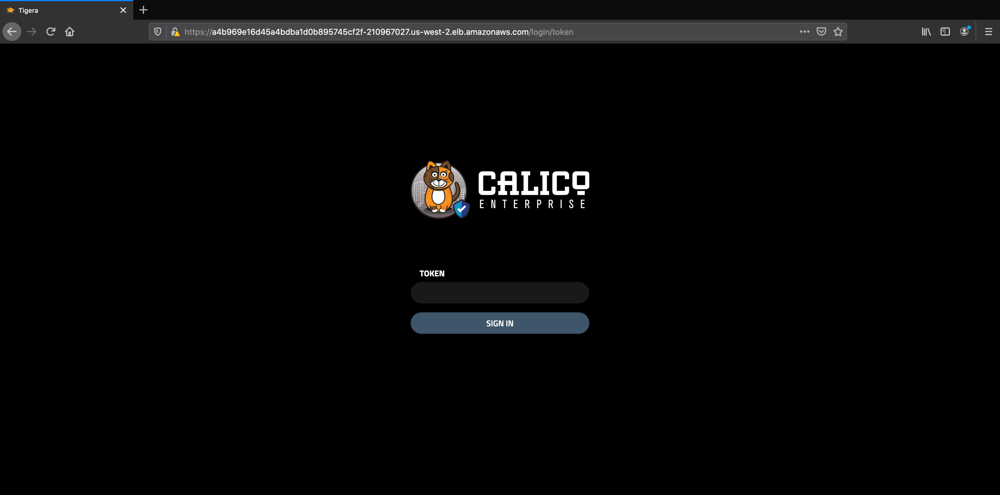

# Module 7: Installing Calico Enterprise

**Goal:** Install and Configure Calico Enterprise on your K8s Cluster.

### Steps

Now it's time to install Calico Enterprise on this cluster. We will be following [these](https://docs.tigera.io/getting-started/kubernetes/self-managed-on-prem/generic-install) steps. 

1. The first step is to set up cloud storage for Calico Enterprise. Since we're running on AWS, we can use the `2-ebs-storageclass.yaml` EBS Storage Class config. On the master node:

  ```
  $ cat 2-ebs-storage-class.yaml 
  apiVersion: storage.k8s.io/v1
  kind: StorageClass
  metadata:
    name: tigera-elasticsearch
  provisioner: kubernetes.io/aws-ebs
  parameters:
    type: gp2
    fsType: ext4
  reclaimPolicy: Retain
  allowVolumeExpansion: true
  volumeBindingMode: WaitForFirstConsumer


  $ kubectl create -f 2-ebs-storageclass.yaml
  storageclass.storage.k8s.io/tigera-elasticsearch created
  ```

2. Now we can create the Tigera and Prometheus Operaters that will create the proper CRDs, RBAC, services needed for Calico Enterprise.

  ```
  $ kubectl create -f https://docs.tigera.io/manifests/tigera-operator.yaml
  $ kubectl create -f https://docs.tigera.io/manifests/tigera-prometheus-operator.yaml
  ```

3. In order to install Calico Enterprise, you need a pull secret to be able to pull the images and a license key. In this step we will install the `dockerjsonconfig` as a pull secret. This file and the trial license key were provided to you previously and were copied to the `/home/ubuntu/calico-fortinet` directory.

  ```
 /calico-fortinet$ kubectl create secret generic tigera-pull-secret \
      --type=kubernetes.io/dockerconfigjson -n tigera-operator \
      --from-file=.dockerconfigjson=dockerjsonconfig.json
  ```

4. Install the Tigera Custom Resource, then ensure the API server is `available` before moving to the next step. 

  ```
  $ kubectl create -f https://docs.tigera.io/manifests/custom-resources.yaml
  $ kubectl get tigerastatus
  $ kubectl get tigerastatus
NAME                  AVAILABLE   PROGRESSING   DEGRADED   SINCE
apiserver             True        False         False      20h
calico                True        False         False      11h
compliance            False        False         False      11h
intrusion-detection   False        False         False      20h
log-collector         False        False         False      11h
log-storage           False        False         False      20h
manager               Fales        False         False      10h
  ```

5. Configure Calico Enterprise license as follows ( assumes you saved your trial license as `license.yaml`)

  ```
/calico-fortinet$ kubectl create -f license.yaml 
  licensekey.projectcalico.org/default created
  ```

6. Finally ensure that the `apiserver` and `calico` and `log-storage` componenets of Calico Enterprise are working as expected. This means that the Calico CNI is working as expected and now we can join the other nodes.  This step may take some time...

  ```
$ kubectl get tigerastatus
NAME                  AVAILABLE   PROGRESSING   DEGRADED   SINCE
apiserver             True        False         False      20h
calico                True        False         False      11h
compliance            True        False         False      11h
intrusion-detection   True        False         False      20h
log-collector         True        False         False      11h
log-storage           True        False         False      20h
manager               True        False         False      10h
  ```


7. It's time now to expose Calico Enterprise UI externally using the `03-loadbalancer.yaml` `LoadBalancer` service. It will automatically created an AWS ELB to front Calico Enterprise using a public IP. 

  ```
  $ cat 3-loadbalancer.yaml 
  kind: Service
  apiVersion: v1
  metadata:
    name: tigera-manager-external
    namespace: tigera-manager
  spec:
    type: LoadBalancer
    selector:
      k8s-app: tigera-manager
    externalTrafficPolicy: Local
    ports:
    - port: 443
      targetPort: 9443
      protocol: TCP

  $ kubectl create -f 3-loadbalancer.yaml 
  service/tigera-manager-external created

  ```

After creating the service, it may take a few minutes for the load balancer to be created. Once complete, the load balancer IP address will appear as an `ExternalIP` in `kubectl get services -n tigera-manager tigera-manager-external`.

```
$ kubectl get services -n tigera-manager tigera-manager-external
NAME                      TYPE           CLUSTER-IP       EXTERNAL-IP                                                              PORT(S)         AGE
tigera-manager-external   LoadBalancer   192.168.200.55   a86f00fcae2d44exxxxx.us-west-2.elb.amazonaws.com   443:31236/TCP   20h
```


8. The final step is to enable Calico Enterprise security policies that will ensure that the various components of the product are secured.

```
kubectl create -f https://docs.tigera.io/manifests/tigera-policies.yaml
```

9. We need to create a user account to be able to log into Calico Enterprise and retrieve the access token to be able to log into the Kibana dashboard.

  ```
  # Creating a Calico Enterprise User called admin and its associated k8s Service Account
  kubectl create sa admin -n default
  kubectl create clusterrolebinding admin-access --clusterrole tigera-network-admin --serviceaccount default:admin
  export calicoToken=$(kubectl get secret $(kubectl get serviceaccount admin -o jsonpath='{range .secrets[*]}{.name}{"\n"}{end}' | grep token) -o go-template='{{.data.token | base64decode}}' && echo)
  echo $calicoToken

  # Get the Kibana Login (Username is **elastic**)
  export elasticToken=$(kubectl get -n tigera-elasticsearch secret tigera-secure-es-elastic-user -o yaml | grep elastic: | awk '{print $2}' | base64 --decode)

  echo $elasticToken
  ```

Keep track of these two tokens as they will be used later on!


10. Finally, you can logint to the Calico Enterprise UI using the loadbalancer and user auth token provided above.



11. If the URL is not loading after some time. Check if the `tigera-manager` pod is running on the `master` node.  If it is, go ahead and delete the pod so it can be rescheduled on another node. The reason this issue is seen is that the ELB doesn't forward to pods deployed on the `master` node since it's on the public subnet.

```
$ kubectl get pod -n tigera-manager -o wide
NAME                             READY   STATUS    RESTARTS   AGE   IP              NODE                                        NOMINATED NODE   READINESS GATES
tigera-manager-76b568d7c-4rcbt   3/3     Running   0          10h   172.16.46.134   ip-10-99-2-239.us-west-2.compute.internal   <none>           <none>

$ kubectl delete pod tigera-manager-76b568d7c-4rcbt -n tigera-manager

```