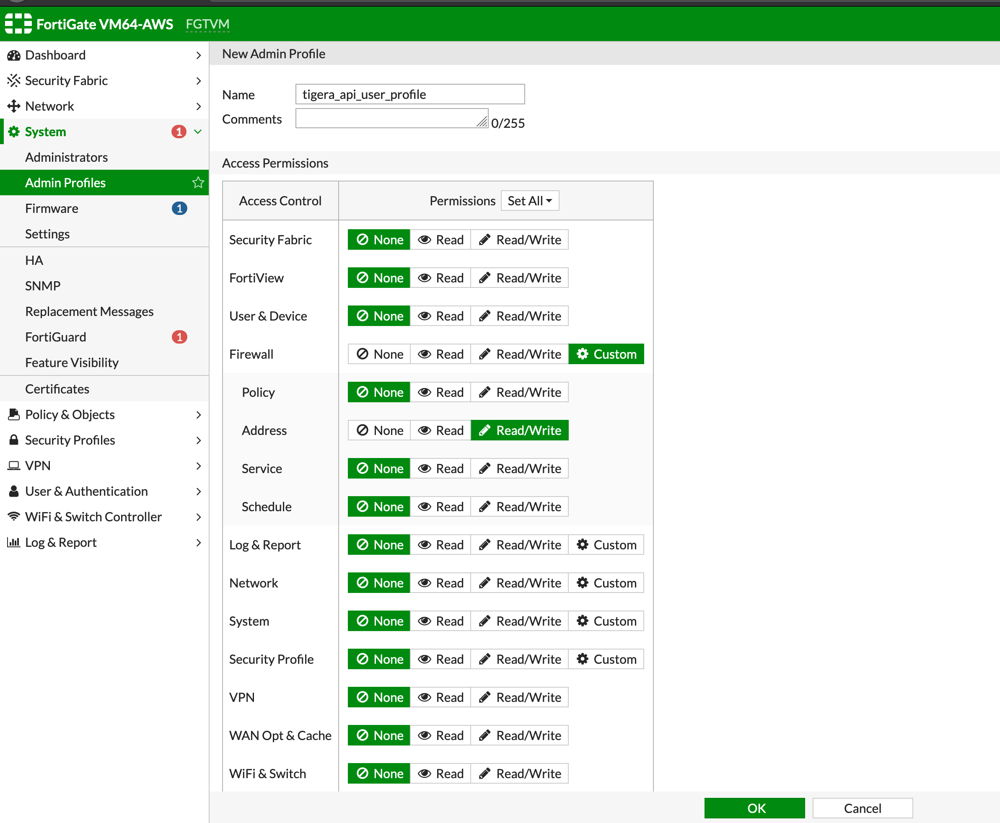
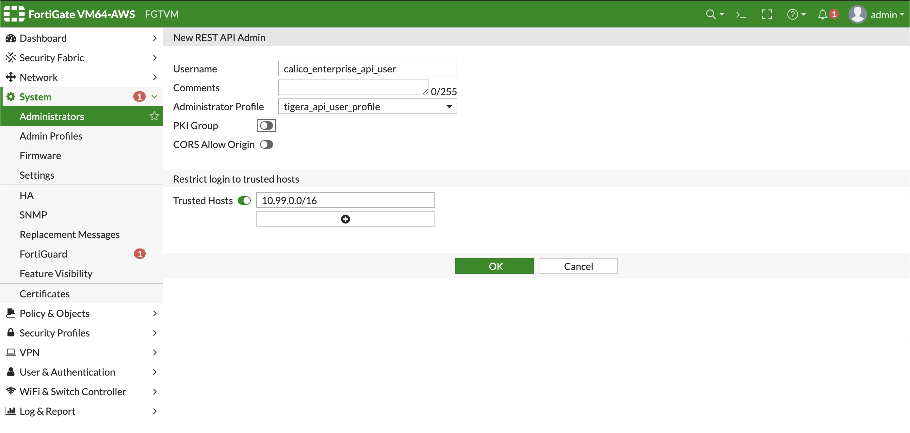

# Module 8: Integrating Calico Enterprise with FortiGate

**Goal:**  The Calico Enterprise/Fortinet integration leverages the power of Calico Enterprise policy selectors to provide Kubernetes workload information to FortiManager and FortiGate devices. You create perimeter firewall policies in FortiManager and FortiGate that reference Kuberetes workloads. Policies are applied and enforced by FortiGate devices. And Firewall administrators can write cluster egress policies that reference Kubernetes workloads directly in Fortinet devices.

## How the integration works

The Calico Enterprise integration controller (`tigera-firewall-controller`) lets you manage FortiGate firewall address group objects dynamically, based on Calico Enterprise GlobalNetworkPolicy.

You determine the Kubernetes pods that you want to allow access outside the firewall, and create Calico Enterprise global network policy using selectors that match those pods. After you deploy the `tigera-firewall-controller` in the Kubernetes cluster, you create a `ConfigMap` with the Fortinet firewall information. The Calico Enterprise controller reads the `ConfigMap`, gets FortiGate firewall IP address, API token and source IP address selection, it can be either node or pod.

In your Kubernetes cluster, if pods IP addresses are routable and address selection is `pod`, then it populates the Kubernetes pod IPs of selector matching pods in FortiGate address group objects or
If source address selection is `node`, then populates the Kubernetes node IPs of selector matching pods in Fortigate address group objects.

## Steps

1. **Configure FortiGate firewall to communicate with firewall controller:**

    a. Determine and note the CIDR’s or IP addresses of all Kubernetes nodes that can run the `tigera-firewall-controller`. This is required to explicitly allow the `tigera-firewall-controller` to access the FortiGate API. In our case, the CIDR is `10.99.0.0/16`

    b. Go to Fortigate from your browser and under **System> Admin Profiles**  tab, create a new profile called `tigera_api_user_profile` with `read-write` access to **Firewall > Addresss**.

      

    c. Under **Administrators** tab,  Create a **REST API Administrator** user called `calico_enterprise_api_user` and associate this user with the `tigera_api_user_profile` profile and add CIDR or IP address of your kubernetes cluster nodes as trusted hosts. Ensure that you toggle the "Trusted Hosts" section to include the `10.99.0.0/16` CIDR.

    

    d. Note the API key.

2. **Configure Calico Enterprise**

    From the master node, you will configure Calico Enterprise. You need to fill in your FortiGate **Private IP** from the `10.99.1.X` subnet in the `4-fortigate-firewall-config.yaml` ConfigMap then apply it.

    >If you integrated FortiGate with FortiManager, and imported FortiGate objects, then configure FortiManager connection as well. For that, comment out the FortiManager related section in `4-fortigate-firewall-config.yaml` file, update `ip` field with your FortiManager's **Private IP**, review and adjust other settings. You will also need to create a secret containing FortiManager API user password. Detailed instructions on how to configure FortiManager API user are in following modules.

    ```yaml
    kind: Namespace
    apiVersion: v1
    metadata:
      name: tigera-firewall-controller
    ---
    # Configuration of Tigera Firewall Controller
    kind: ConfigMap
    apiVersion: v1
    metadata:
      name: tigera-firewall-controller-configs
      namespace: tigera-firewall-controller
    data:
      # FortiGate device information
      tigera.firewall.fortigate: |
        - name: fortigate
          ip: 10.99.1.X   ####### UPDATE with FortiGate Private IP
          apikey:
            secretKeyRef:
              name: fortigate
              key: fortigate-key
      # This part required when using FortiManager integration
      tigera.firewall.fortimgr: |-
      #   - name: fortimgr
      #     ip: 10.99.1.X   ####### UPDATE with FortiManager Private IP
      #     username: tigera_fortimanager_admin
      #     adom: root
      #     password:
      #       secretKeyRef:
      #         name: fortimgr-ns
      #         key: fortimgr-pwd
    ---
    apiVersion: v1
    kind: ConfigMap
    metadata:
      name: tigera-firewall-controller
      namespace: tigera-firewall-controller
    data:
      tigera.firewall.addressSelection: node
      tigera.firewall.policy.selector: projectcalico.org/tier == 'fortigate'
    ```

    Then you can apply it:

    ```bash
    kubectl create -f 4-fortigate-firewall-config.yaml
    ```

3. **Create FortiGate API User and Key as Kubernetes Secrets**

    Store each FortiGate API key as Secret in `tigera-firewall-controller` namespace.
    for example, In the above config map for FortiGate device `fortigate`, store its ApiKey as a secret name as `fortigate`, with key as `fortigate-key`

    ```bash
    kubectl create secret generic fortigate \
    -n tigera-firewall-controller \
    --from-literal=fortigate-key=<fortigate-api-secret>
    ```

4. Deploy firewall controller in the Kubernetes cluster

    a. Copy Tigera pull secret into `tigera-firewall-namespace` namespace:

    ```bash
    kubectl get secret tigera-pull-secret --namespace=calico-system -o yaml | \
    grep -v '^[[:space:]]*namespace:[[:space:]]*calico-system' | \
    kubectl apply --namespace=tigera-firewall-controller -f -
    ```

    b. Download Fortinet integration manifest

    ```bash
    curl -O https://downloads.tigera.io/ee/v3.18.1/manifests/fortinet.yaml
    ```

    c. Review and apply the manifest

    ```bash
    kubectl apply -f fortinet.yaml
    ```

5. Verify that the deployment of the controller is successful:

    ```
    $ kubectl get pod  -n tigera-firewall-controller

    NAME                                          READY   STATUS    RESTARTS   AGE
    tigera-firewall-controller-586bb9756d-b2qfw   1/1     Running   0          1m
    ```

6. In the case the pod doesn't show as "Running". You can issue `kubectl describe pod <POD_NAME> -n tigera-firewall-controller` and `kubectl logs <POD_NAME> -n tigera-firewall-controller` to collect additional info on what issue you're hitting.

[Module 7 :arrow_left:](../modules/installing-calico.md) &nbsp;&nbsp;&nbsp;&nbsp;[:arrow_right: Module 9](../modules/deploy-app-0.md)

[:leftwards_arrow_with_hook: Back to Main](/README.md)
