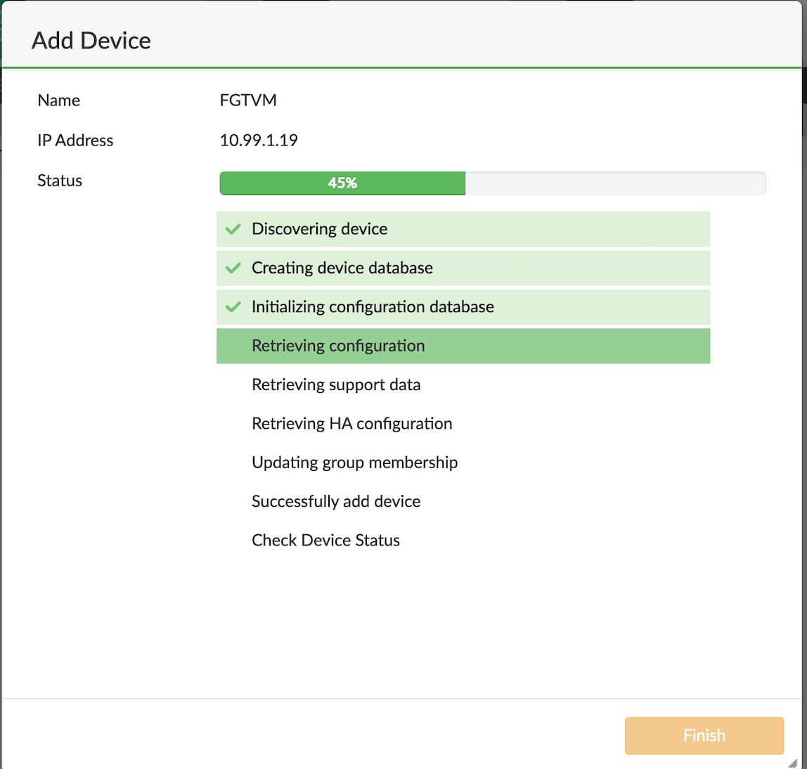

# Module 7: Integrating FortiGate with FortiManager

Goal: Integrate FortiGate with FortiManager.

### Steps

1. From your browser, access FortiManager's IP using the output IP.

2. Log in to FortiManager using username=admin and password=<instance-id>.

3. Change the default password using the provided instructions.

4. Log In to FortiManager using the new password.

5. Add the FortiGate by going to **Add Device > Discover Device**. Provide FortiGate's **Private IP/Username/Password** and click **Next**. Follow the instrctions until the device is added then click **Finish**

