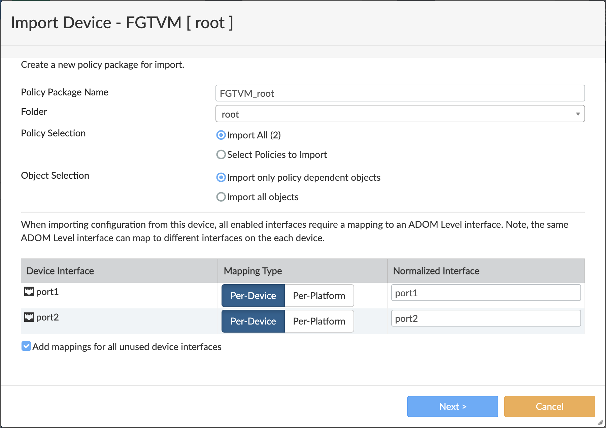

# Module 10: Integrating FortiGate with FortiManager

>**THIS MODULE IS NOT READY YET.** PLEASE SKIP TO [MODULE 12](../modules/integrate-calico-with-fortimanager.md).

**Goal:** Integrate FortiGate with FortiManager.

## Steps

1. From your browser, access FortiManager's IP using the output IP.

2. Log in to FortiManager using username=admin and password=<instance-id>.

3. Change the default password using the provided instructions.

4. Log In to FortiManager using the new password.

5. Add the FortiGate by going to **Add Device > Discover Device**. Provide FortiGate's **Private IP/Username/Password** and click **Next**. Follow the instructions until the device is added.

    

6. If prompted to import `policies and objects` for added device, go ahead and import the objects. Follow the wizard steps to review imported objects and complete the import.

    

[Module 9 :arrow_left:](../modules/deploy-app-0.md) &nbsp;&nbsp;&nbsp;&nbsp;[:arrow_right: Module 11](../modules/manage-north-south-policies-with-fortimanager.md)

[:leftwards_arrow_with_hook: Back to Main](/README.md)
