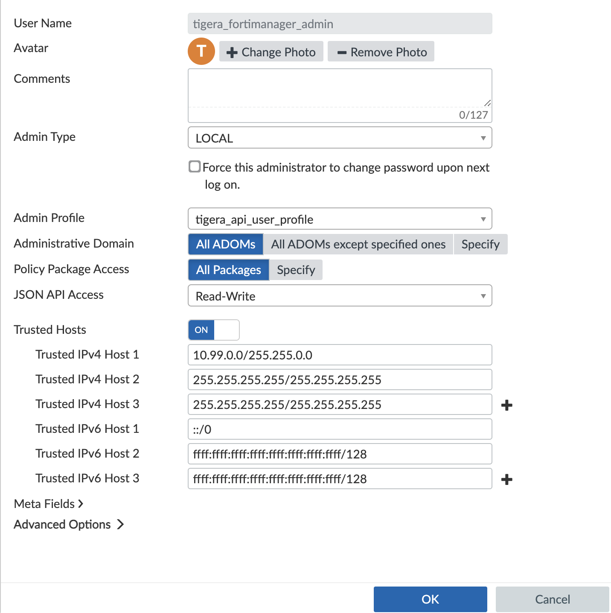

# Module 11: Manage North-South policies with FortiManager

**Goal:** Once FortiGate is integrated with FortiManager, all policies can be managed from within a single user interface - FortiManager. We are now ready to verify the integration by creating and managing the policies in FortiManager UI.

## Steps

1. Configure FortiManager to communicate with firewall controller

    a. Determine and note the CIDR’s or IP addresses of all Kubernetes nodes that can run the `tigera-firewall-controller`. This is required to explicitly allow the `tigera-firewall-controller` to access the FortiGate API. In our case, the CIDR is `10.99.0.0/16`

    b.  Go to FortiManager from your browser, from **System Settings**, create a new  profile named `tigera_api_user_profile` with `Read-Write` access for `Policy & Objects`. 

    c. Under **Administrators** tab, create a new user named `tigera_fortimanager_admin` and associate this user with the `tigera_api_user_profile` profile. Make sure that you enable **All Packages** and **Read-Write** for the JSON API Access. Enable `Trusted Hosts` field and provide CIDR for Kubernetes nodes. In our case, it is `10.99.0.0/16`.

    

    d. Note username (`tigera_fortimanager_admin`) and password you used.

2. Configure Calico Enterprise connection to FortiManager

    a. Configure secret `fortimgr` with password for FortiManager API user `tigera_api_user_profile`. 

    ```bash
    kubectl create secret generic fortimgr -n tigera-firewall-controller --from-literal=fortimgr-pwd=<fortimanager-api-user-password>
    ```

    b. From the master node, you will configure Calico Enterprise. You need to uncomment FortiManager related configuration and fill in your FortiManager **Private IP** from the `10.99.1.X` subnet, user name (`tigera_fortimanager_admin`) and password in the `4-fortigate-firewall-config.yaml` ConfigMap then apply it.

    ```bash
    kubectl create -f 4-fortigate-firewall-config.yaml
    ```

3. Import FortiGate policy into FortiManager

    In order to preserve any policies configured in FortiGate, we need to import FortiGate policies into FortiManager.

[Next -> Module 12](./modules/integrate-calico-with-fortimanager.md)
