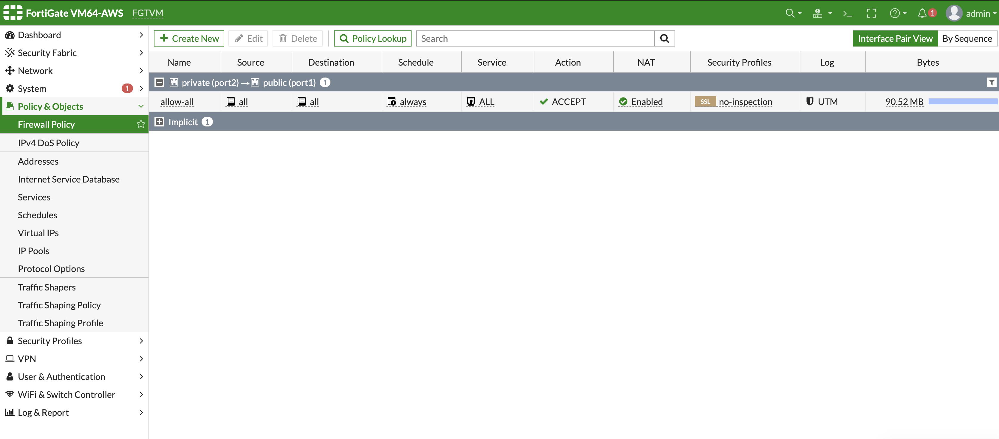

## Module 2: Configurating your Fortigate Firewall to allow internet traffic for the K8s Cluster

Goal: In this step, you will configure FortiGate firewall.

### Steps

1. From your browser, log into Fortigate Firwalle using the public IP and port `8443` provided to you in the output of the `terraform apply` step.

2. The default username is `admin` and the default password is the **EC2 Instance ID**. Once you log int, change the password. Then log in with the new password that you created.

3. Navigate to **Policy and Objects** > **Firewall Policy** then create a policy to allow traffic from **Port 2** --> **Port 1**. This is required to ensure that traffic from the k8s cluster passes through the FortiGate firewall.

